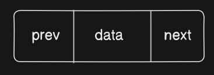

# Doubly Linked List
## know the node
In the node you have three parts 
1. data => holds the data 
2. next => holds the referrence of the next node
3. prev => holds the reference of the previous node


``` javascript
class Node {
    constructor(data, next = null, prev = null){
        this.data = data 
        this.next = next
        this.prev = prev
    }
}
```
## Know the contents of an empty doubly linked list 
you have two parts 
1. head => the first node of the list 
2. tail => the last node of the list

> Initially the head and tail of the doubly linked list will be ***null*** 
 
``` javascript
class DoublyLinkedList {
    constructor () {
        this.head = null
        this.tail = null
    }
}
```

## operations on Doubly Linked List
### Insertion of node at beginning


| No | Number of cases = 2| 
| ----------- | ----------- |
| 1 | When there are ***no elements*** int the list |
| 2 | When there are elements  |

1. When there are no elements in the list
    - head = newNode
    - tail = newNode
2. when there are elements already point 
    - newNode.next = head
    - head.prev = newNode
    - head = newNode

***Note: Node(data, head, null)***

``` javascript
DoublyLinkedList.prototype.insertAtTheBeginning = function(data) {
    const newNode = new Node(data, this.head, null)
    if(this.head !== null) {
        this.head.prev = newNode
    }

    this.head = newNode // this line happens in both cases

    if(this.tail === null){
        this.tail = newNode
    }
}
```

### Insertion at the end
| No | Number of cases = 2| 
| ----------- | ----------- |
| 1 | When there are ***no elements*** int the list |
| 2 | When there are elements  |

1. When there are no elements
    - tail = newNode
    - head = newNode
2. when there are elements
    - newNode.prev = tail
    - tail.next = newNode
    - tail = newNode

***Note: Node(data, null, tail)***
``` javascript
DoublyLinkedList.prototype.insertAtTheEnd = function(data) {
    const newNode = new Node(data, null, this.tail)
    if(this.tail !== null) {
        this.tail.next = newNode
    }
    this.tail = newNode
    if(this.tail === null){
        this.head = newNode
    }
}
```

### Insert after a given data
- we need to have the previous Node to insert the data 

| No | Number of cases = 3| 
| ----------- | ----------- |
| 1 |if previous node is invalid|
| 2 | when previous node is the last node |
| 3 | when previous node is not the last node |

1. if previous node is invalid
    - print error message
2. when previous node is the last node
    - newNode.prev = prevNode
    - newNode.next = prevNode.next
    - prevNode.next = newNode
    - tail = newNode
3. when previous node is not the last node
    - newNode.prev = prevNode
    - newNode.next = prevNode.next
    - prevNode.next.prev = newNOde
    - prevNode.next = newNode
***Note: Node(data, prevNode.next, prevNode)***
``` javascript
DoublyLinkedList.prototype.insertAtTheEnd = function(prevNode,data) {
    if(prevNode === null){
        console.log("Invalid previous node")
    }
    const newNode = new Node(data, prevNode.next, prevNode)
    if(prevNode.next !== null){
        prevNode.next.prev = newNode
    }
    prevNode.next = newNode
    if(prevNode === null){
        this.tail = newNode
    }
}
```

### Delete first node

| No | Number of cases = 2| 
| ----------- | ----------- |
| 1 |if there are no elements in the list |
| 2 | if there is only one element in the list |
| 3 | when there are more than one element in the list |

1. no elements in the list 
    - nothing to return / can print list is empty
2. one element in the list 
    - this.head = null
    - this.tail = null
3. more than one element in the list 
    - this.head = this.head.next
    - this.head.prev = null

``` javascript
DoublyLinkedList.prototype.deleteFirstNode = function() {
    if(this.head === null) {
        console.log("the list is empty")
        return
    } 
    if(this.head === this.tail){
        this.head = null
        this.tail = null
    } else {
        this.head = this.head.next
        this.head.prev = null
    }
}
```

### Delete last node

| No | Number of cases = 2| 
| ----------- | ----------- |
| 1 |if there are no elements in the list |
| 2 | if there is only one element in the list |
| 3 | when there are more than one element in the list |

1. no elements in the list 
    - nothing to return / can print list is empty
2. one element in the list 
    - this.head = null
    - this.tail = null
3. more than one element in the list 
    - this.tail = this.tail.prev
    - this.tail.next = null

``` javascript
DoublyLinkedList.prototype.deleteLastNode = function() {
    if(this.tail === null) {
        console.log("the list is empty")
        return
    } 
    if(this.head === this.tail){
        this.head = null
        this.tail = null
    } else {
        this.tail = this.tail.prev
        this.head.next = null
    }
}
```

### reverse list

1. we need two variables
    1. current => points to the head 
    2. temp => initially set to null

2. loop till current reaches null
    - temp = current.prev
    - current.prev = current.next
    - current.next = temp
    - current = current.prev
3. as there are elements in the list and current reached null
    - tail = head
    - head = temp.prev

``` javascript
DoublyLinkedList.prototype.reverse = function(){
    let current = this.head;
    let temp = null
    while(current){
        // swapping
        temp = current.prev
        current.prev = current.next
        current.next = temp
        // move to next node
        current = current.prev
    }
    if(temp !== null) {
        this.tail = this.head
        this.head = temp.prev
    }
}
```