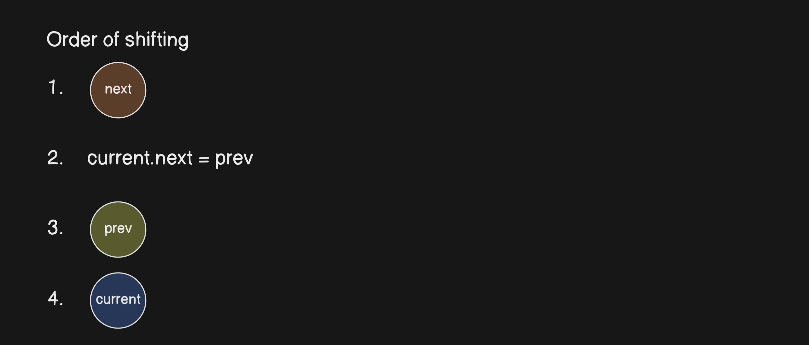

# LinkedList
## Know the node
In the node you have two parts
1. data => holds the data
2. next => holds the referrece of the next node

``` javascript
class Node {
    constructor(data, next = null) {
        this.data = data 
        this.next = next
    }
}
```

## Know the contents of an empty linked list 
You have only one part 
1. head => first node of the list
> Initially the head of the linked list will be ***null*** 

``` javascript 
class LinkedList {
    constructor() {
        this.head = null
    }
}
```

## Operations on Linked List

<details>
  <summary>Insertion of node at beginning </summary>

### Insertion of node at beginning

| No | Number of cases = 2|  |
| ----------- | ----------- | -- |
| 1 | When there are ***no elements*** in the list |  |
| 2 | When there are elements  |  |


1. For both the above cases
    - newNode.next = head
    - head = newNode
``` javascript
LinkedList.prototype.insertAtBeginning = function(data){
    const newNode = new Node(data, this.head)
    // newNode.next = this.head
    this.head = newNode
}
```
</details>

<details>
  <summary> Insertion at the end</summary>

### Insertion at the end

| No | Number of cases = 2|  | 
| ----------- | ----------- | -- |
| 1 | When there are ***no elements*** in the list |  |
| 2 | When there are elements  |  |


1. When there are no elements
    - head = newNode
2. when there are elements
    - initialize a variable `last` with reference to head
    - move `last` to the end of the list
    - last.next = newNode

``` javascript
LinkedList.prototype.insertAtEnd = function(data){
    const newNode = new Node(Data)
    if(this.head === null){
        this.head = newNode
        return
    }
    let last = this.head
    while(last.next){
        last = last.next
    }
    last.next = newNode
}
```
</details>

<details>
  <summary> Insert after a given node</summary>

### Insert after a given node
- we need to have a previous node to insert data

| No | Number of cases = 2|  |
| ----------- | ----------- | -- |
| 1 | if the previous node is invalid |
| 2 | insertion after node  |  | 

1. if the previous node in invalid 
    - print error message 
2. insertion after a node
    - newNode.next = prevNode.next
    - prevNode.next = newNode
***Note: Node(data, prevNode.next)***
``` javascript
LinkedList.prototype.insertAtEnd = function(prevNode, data){
    if(prevNode === null) {
        console.log("The given previous node is invalid")
        return
    }
    const newNode = new Node(data, prevNode.next)
    prevNode.next = newNode
}
```
</details>

<details>
  <summary> delete first node </summary>

### delete first node

| No | Number of cases = 2|   |
| ----------- | ----------- | -- |
| 1 | if there are no elements |
| 2 | if there are elements  |  | 

1. if there are no elements elements 
    -  return nothing (print list is empty)
2. head = head.next

``` javascript
LinkedList.prototype.deleteFirstNode = function(prevNode, data){
    if(this.head === null){
        console.log("the list is empty")
        return
    }
    this.head = head.next
}
```
</details>
<details>
  <summary>delete last node </summary>

### delete last node 
| No | Number of cases = 3|   |
| ----------- | ----------- | -- |
| 1 | if list is empty |
| 2 | if there is only one node  | | 
| 3 | if there are multiple nodes  |  | 

1. if the list is empty
    - return nothing (print list is empty)
2. only one node 
    - this.head = null
3. multiple nodes
    - intialise a variable `secondLast` with reference of head
    - traverse to the second last node
    - secondLast.next = null

``` javascript
LinkedList.prototype.deleteLastNode = function() {
    if(this.head === null) {
        console.log("List is empty")
        return
    }
    if(this.head.next === null){
        this.head = null
    }
    let secondLast = this.head
    while(secondLast.next.next) {
        secondLast = secondLast.next
    }
    secondLast.next = null
}
```
</details>

<details>
   <summary>delete by Key</summary>

### delete by Key
| No | Number of cases = 3|  |
| ----------- | ----------- | -- |  
| 1 | if list is empty |
| 2 | if the key is in the head node  | | 
| 3 | key is in some other location |  | 
| 4 | key is not there in the list | | 

1. if list is empty
    - return (print list is empty)
2. key is in head 
    - head = head.next
3. key is in other location
    - initialize a variable `current` with reference of head 
    - traverse current to the last node with loop
    - while traversing if you find current.next.data is the key 
        - current.next = current.next.next
4. if key is not found 
    - print key not found

``` javascript
LinkedList.prototype.deleteByKey = function(key){
    if(this.head === null) {
        console.log("list is empty")
        return
    }
    if(this.head.data === key){
        this.head = this.head.next
        return
    }
    let current = this.head
    while(current.next) {
        if(current.next.data = key){
            current.next = current.next.next
            return
        }
    }
    console.log("No node found with key ",key )
}

```

</details>


<details>
   <summary>search</summary>

### search key
| No | Number of cases = 2|  | 
| ----------- | ----------- |-- 
| 1 | if key is present | | 
| 2 | if key is not present  |  | 

1. if key is present
    - return `true`
2. if ket is not present
    - return `false`

``` javascript
List.prototype.search = function(key) {
    let current = this.head
    while(current){
        if(current.data === key){
            return true
        }
    current = current.next
    }
    return false
}
```
</details>

<details>
    <summary>traversal</summary>

### traveral
1. print list
    - intialize a variabe `current` with reference of head
    - intitialse a empty array `listValues`
    - loop current and push each node data to the listValues till current reaches the last node
``` javascript
LinkedList.prototype.printList = function() {
    let current = this.head
    let listValues = []
    while(current !== null) {
        listValues.push(current.data)
        current = current.next
    }
    if(this.head) {
        console.log(listValues.join(" ->"))
    } else {
        console.log("list is empty")
    }
}
```
</details>

<details>
    <summary>reverse a linked list</summary>

### reverse linked list
1. we need 3 variables to perform this operation
    1. current => which points the the head 
    2. prev => initially null
    3. next => initially null



2. loop till current reaches null
    - next = current.next
    - current.next = prev
    - prev = current
    - current = next


3. after coming out of the loop
    - head = prev


- At first prev and next will be null and current will point to the head
- make next as the next of current 
- point the next of current to the previous
- make the previous node the current node 
- make the current node the next node
- repeat the above steps till you reach the last node
- make the previous the head

``` javascript 
List.prototype.reverse = function() {
    let current = this.head
    let prev = null 
    let next = null
    while(current) {
        next = current.next
        current.next = prev
        prev = current
        current = next
    }
    this.head = prev
}
```
</details>